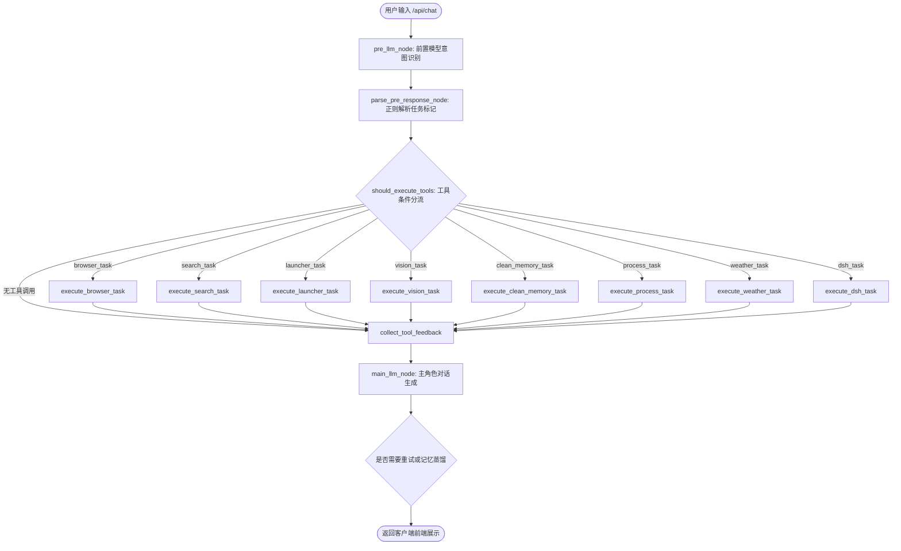

# 东方桌宠核心架构与运行机制

## 一、双进程分层架构

东方桌宠采用现代化的桌面端双进程架构：
1. **渲染与桌面交互层 (Electron)**：
   - 宿主主进程：[`main.js`](file:///g:/code/rumia/main.js)，负责透明无边框窗口创建、托盘菜单、鼠标穿透检测、全局快捷键、全屏游戏自动最小化以及与 Python 后端生命周期的同步管理；
   - 渲染进程：基于 Web 技术，加载 Live2D 模型（Cubism 2/4）、Pixi.js、气泡对话框及音效播放。
2. **决策与业务大脑层 (FastAPI + LangGraph)**：
   - 入口文件：[`services/web_interface.py`](file:///g:/code/rumia/services/web_interface.py)（监听本地 `http://127.0.0.1:5000`）；
   - 核心决策中枢：使用 LangGraph 状态机驱动的 ReAct 闭环对话与工具调用图。

---

## 二、LangGraph 拓扑图与状态流转

LangGraph 工作流位于 [`services/graph/workflow.py`](file:///g:/code/rumia/services/graph/workflow.py)，由以下节点与路由边构成：

---

## 三、会话持久化与状态隔离

* **SQLite Checkpointer (`rumia_checkpoints.db`)**：LangGraph 使用 `SqliteSaver` 按 `thread_id = f"{char_id}_chat_thread"` 自动持久化状态；
* **单轮隔离规范**：每轮对话开始前，[`chat.py`](file:///g:/code/rumia/services/api/routers/chat.py) 与 `parse_pre_response_node` 必须强制重置所有 `*_task: None` 和 `*_result: None`，以防历史旧状态在多轮交互中发生脏数据继承。
