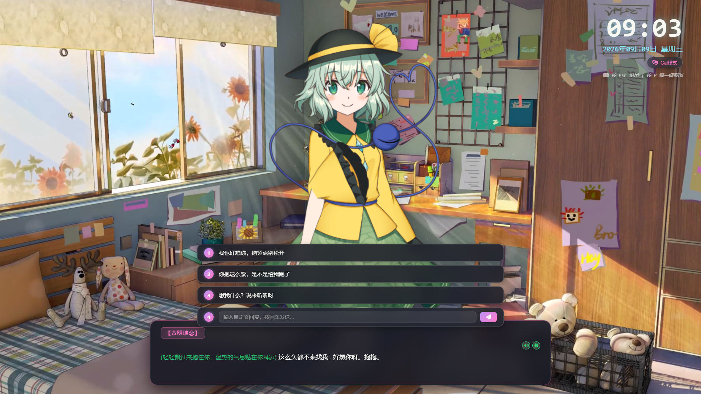
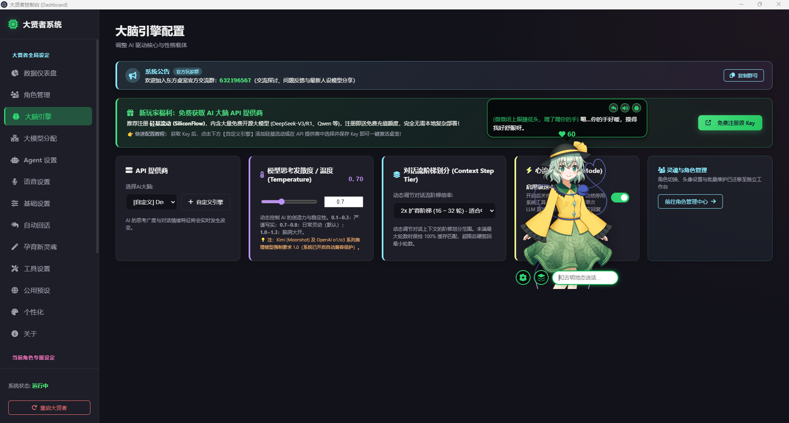
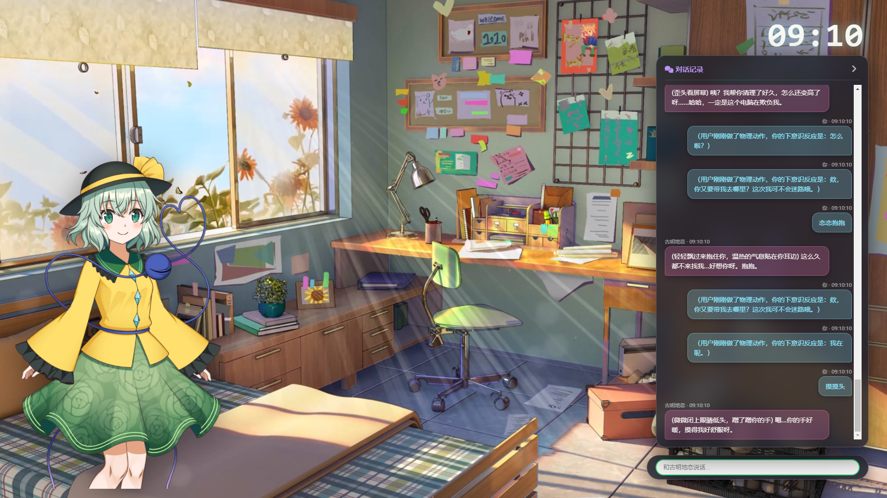
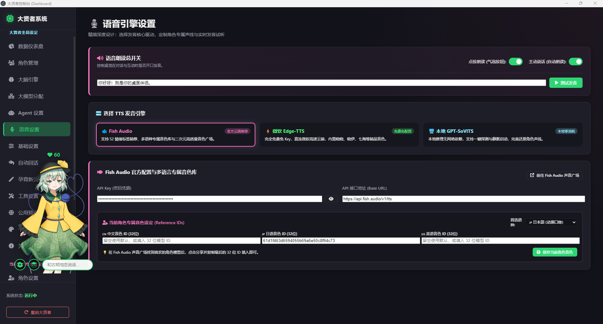
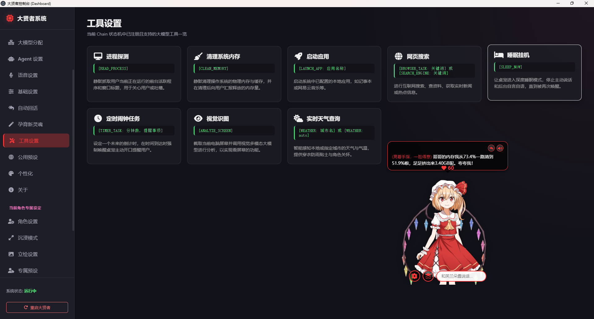
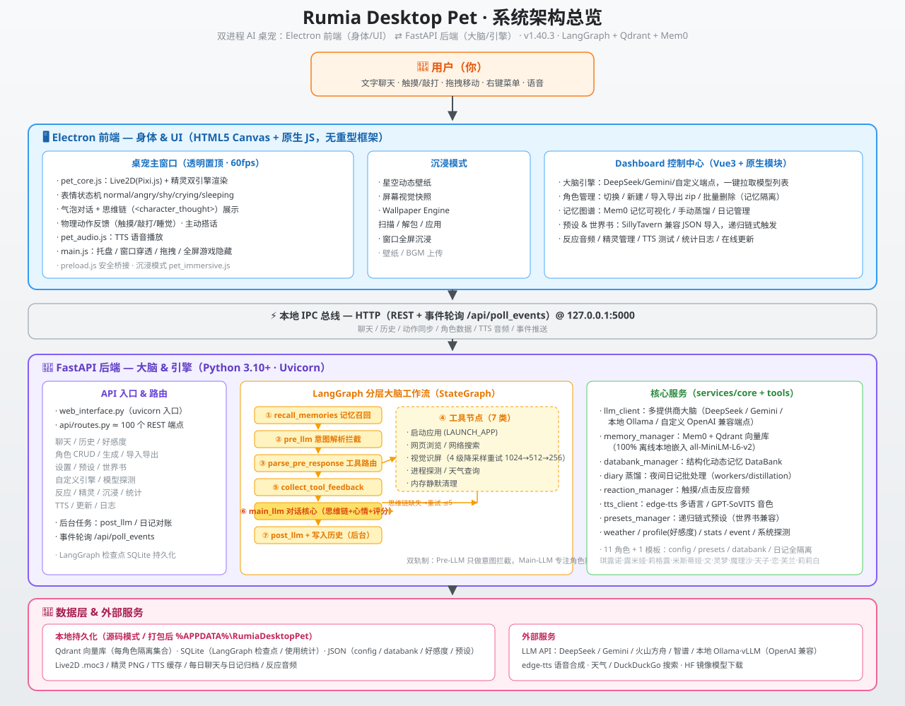

# 🌟 Touhou Pet (大贤者桌宠) - 次世代东方 AI 虚拟伴侣引擎

<div align="center">


<p align="center">
  <b>或许是史上最懂你的东方桌面宠物！</b><br>
  集成了 <b>大量东方角色以及自定义角色功能</b>、<b>Live2D </b>、<b>全屏沉浸/GAL 模式</b>、<b>支持多接口语音生成</b>、<b>酒馆级别的桌宠活人感</b>、<b>内置DSH 智能体，可直接操作电脑</b> 与 <b>兼容酒馆世界书生态</b> 的工业级桌面伴侣引擎。
</p>

</div>

---

<div align="center">
  
  <p align="center"><i> 可能是世界上第一个自动生成对话的galgame </i></p>
</div>

---

## 核心革新

相比传统的死板静态立绘桌宠或简单的 ChatGPT 问答挂件，**东方桌宠**的优势在于：
1. **支持live2d**：告别僵硬切图，全量搭载 **Live2D Cubism** 动态物理引擎，眼动追随光标、呼吸微动、抚摸反馈、触碰 Q 弹与多重动作姿态；
2. **酒馆级别的深层人格与永久记忆**：采用 **LangGraph ReAct 状态机** + **Qdrant 向量数据库** + **动态数据库 (DataBank)**，白天同你交流、深夜独立写日记，永远记住关于你的点点滴滴；
3. **不只是对话的桌宠**：内置 **DeepSeek Harness (DSH)** 智能体以及大量工具，可直接读写本地文件、执行指令、监控进程、静默内存优化，化身桌面全能管家；
4. **支持全屏沉浸伴侣与 GAL 游戏视界**：一键切换沉浸伴侣视差全屏模式或 GAL 文字冒险模式，支持 Wallpaper Engine 动态壁纸与 MP4 本地视频联动！

---

## 核心特性

### 1. Live2D 动态视界与东方全明星角色阵容
* **官方级 Live2D Cubism 物理引擎驱动**：内置眼球与头部追踪鼠标、呼吸起伏、触摸反馈（Tap）、拖拽惯性倾斜与物理弹性阻尼。
* **东方 Project 全明星灵魂**：内置了 **芙兰朵露 (Flandre)**、**古明地恋 (Koishi)**、**比那名居天子 (Tenshi)**、**射命丸文 (Aya)**、**博丽灵梦 (Reimu)**、**雾雨魔理沙 (Marisa)**、**露米娅 (Rumia)**、**莉莉白 (Lily)**、**米斯蒂娅 (Mystia)**、**莉格露 (Wriggle)**、**琪露诺 (Cirno)** 等 10+ 位经典东方角色！
* **物理隔离的独立灵魂**：每个角色的 Live2D 模型、立绘偏移缩放、好感度档案、AI 人格提示词、专属日记与向量记忆库完全物理隔离，切换角色即切换整个灵魂容器。

<div align="center">
  
  <p align="center"><i> Live2D 动态陪伴 · 融合控制台与实时状态感知 </i></p>
</div>

---

### 2. 全屏沉浸模式（伴侣模式 + GAL 视觉小说模式）
* **伴侣模式 (Companion Mode)**：全屏无边框，桌宠在动态壁纸中安详陪伴。
* **GAL 模式 (Gal Mode)**：瞬间将桌面化为galgame！
* **全格式动态视界联动**：可自定义多种格式壁纸，并支持直接读取 Wallpaper Engine 创意工坊动态壁纸！

<div align="center">
  
  <p align="center"><i> 双模全屏沉浸视界 · 侧边栏历史溯源与视差动态壁纸联动 </i></p>
</div>

---

### 3. 多引擎拟真音声 (TTS) 与离线语音
* **多引擎调度中心**：
  * **微软 Edge-TTS**：免 API Key、零成本的高保真微软自然女声；
  * **Fish Audio S2 情感音调精修**：支持日/英口语自适应修润，自动注入 `[giggle]`, `[whisper]`, `[soft tone]` 等情绪音频控制标签；
  * **GPT-SoVITS 直连**：无缝对接本地部署的 GPT-SoVITS 声音克隆服务，享受专属角色的原声还原。
* **离线语音**：支持对每个角色的多种短句进行离线全量预录。日常戳碰角色时，**毫秒级零网络延迟**播放本地缓存语音，体验极度丝滑！

<div align="center">
  
  <p align="center"><i> 多引擎拟真音声调度 · 微软 Edge-TTS / Fish Audio S2 / GPT-SoVITS 深度克隆 </i></p>
</div>

---

### 4. 工业级 LangGraph ReAct 状态机与多模型分工
* **让模型各司其职**：彻底抛弃“单模型硬抗所有任务”的落后设计，重构为 **Pre-LLM**（意图识别/任务路由）、**Main-LLM**（纯粹角色扮演核心对白）、**Post-LLM**（数据结构化归档）的三层流水线。
* **极致自由的大模型支持**：完全由你掌控的大脑引擎！原生支持 **DeepSeek**、**Kimi**、**智谱 GLM**、**通义千问**、**硅基流动** 等所有兼容 OpenAI 格式的在线 API，亦可 100% 本地纯离线运行 **Ollama** 与 **vLLM** 本地大模型。
* **一键智能拉取模型**：输入 Base URL 与 Key，控制台自动探测并拉取远端全部可用模型列表。

---

### 5. DeepSeek Harness (DSH) 操作系统级智能体
* **从聊天玩具到全能桌面管家**：桌宠不仅会撒娇，更能为你干活！
* **深度权限与系统控制**：支持常驻守护进程与按需响应。桌宠可安全执行 PowerShell 系统命令、实时探查 Windows 正在运行的任务进程、检索本地文件、调起常用应用、执行静默内存释放并向你邀功汇报。

<div align="center">
  
  <p align="center"><i> DSH 操作系统级智能体 · 进程监控、网页搜索与静默内存加速工具 </i></p>
</div>

---

### 6. 真正的终身记忆：动态数据库 (DataBank) 与 Qdrant 向量海
* **双轨制大脑架构**：
  * **短期语义缓存 (Qdrant)**：向量级语义嵌入记忆检索，精准定位过往回忆；
  * **结构化长效数据库 (DataBank)**：包含状态表、偏好表、代办表、社交关系表等多维动态表格，桌宠对话中自动动态更新行与列。
* **深夜自动回忆总结**：夜间自动批处理当天的聊天记录，生成角色视角的私密日记，并在往后漫长的岁月里自然向你提起过去。

---

### 7. 完美兼容酒馆世界书 (SillyTavern WorldBook) 与递归预设
* **硬核 RP 玩家无缝迁移**：原生支持一键导入 SillyTavern 酒馆的世界书 `*.json` 文件。
* **递归预设引擎**：支持设定触发关键词、好感度阶梯门槛、递归深度控制，确保世界观、人设与说话风格严格咬合，杜绝角色出戏或 AI 八股味。

---

### 8. 智能自动回话建议 (Auto Replies)
* 告别打字卡顿！系统根据上下文自动异步为你准备 **3 种截然不同情绪的态度候选项**（温柔关切、调侃戏谑、深入追问）。
* 桌面气泡一键点击即可快速装填，体验如同面对真实女友般的流畅连珠对白。

---

### 9. 极速开屏转场 (Splash) 与自动自愈容灾引擎
* **毫秒级极速开屏**：告别启动白屏等待，带有进度流转与角色动态浮现的开屏加载界面。
* **全自动 Python 虚拟环境探测与自愈**：主进程自动检索 `.venv` 本地虚拟环境。若后端服务意外中断，Electron 会在打开控制台时**毫秒级自动重拉并恢复健康**，彻底告别死机与白屏！

---

## 系统架构拓扑 (Architecture Topology)

<div align="center">
  
</div>

---

## 快速开始 (Quick Start)

### 系统与环境依赖
* **操作系统**：Windows 10 / Windows 11 (64-bit)
* **Python**：3.10 或更高版本（已内置便携/自动安装脚本）
* **Node.js**：18.0 或更高版本

---

### 极速一键启动（推荐小白用户）
本项目支持全自动化“零门槛启动脚本”：
1. 下载仓库源码或 Release 安装包解压至英文路径；
2. 直接双击根目录的 **`start.bat`**；
3. 脚本会自动检测并补全 Python 虚拟环境与前端 Node 依赖，全自动唤醒桌宠并呈现开屏视界！

---

### 开发者手动启动步骤
如果你习惯在终端中调试：

```bash
# 1. 克隆本仓库
git clone https://github.com/mystiafly/Touhou_Pet.git
cd Touhou_Pet

# 2. 安装 Python 后端核心依赖
python -m venv .venv
.\.venv\Scripts\activate
pip install -r requirements.txt

# 3. 安装前端 Electron 依赖
npm install

# 4. 唤醒桌面伴侣
python run.py
# 或直接启动前端
npm start
```

启动成功后，右键点击屏幕上的桌宠，选择 **“大贤者控制台 (Dashboard)”**，在“大脑引擎”中填入你的 API Key，或者接入本地模型，芙兰朵露与众少女便会立刻苏醒！

---

## ⭐ Star History 

如果这只充满灵气、拥有自己记忆与声音的东方桌宠陪伴到了你，请为我们点亮右上角的 **Star ⭐**！你的每一颗星都是驱动大贤者进化出更多新特性的最大能量源！

<div align="center">

<a href="https://www.star-history.com/?type=date&repos=mystiafly%2FTouhou_Pet">
 <picture>
   <source media="(prefers-color-scheme: dark)" srcset="https://api.star-history.com/chart?repos=mystiafly/Touhou_Pet&type=date&theme=dark&legend=top-left&sealed_token=XSBTu-06HGN34OPAHBNbsuTQlBnXRNP14KB4o8r-VlzbuTTpO8SbsaYX9Ozqp9iK9xj9-_FBfM9Bh6MaBvk_aTAos1H8GT5IRWK1z9Ldf_qSMjb9YUC9zg" />
   <source media="(prefers-color-scheme: light)" srcset="https://api.star-history.com/chart?repos=mystiafly/Touhou_Pet&type=date&legend=top-left&sealed_token=XSBTu-06HGN34OPAHBNbsuTQlBnXRNP14KB4o8r-VlzbuTTpO8SbsaYX9Ozqp9iK9xj9-_FBfM9Bh6MaBvk_aTAos1H8GT5IRWK1z9Ldf_qSMjb9YUC9zg" />
   
 </picture>
</a>

</div>

---

## 📄 开源许可证 (License)

本项目遵循 [MIT License](LICENSE) 开源协议。自由地修改、打包、扩展并分享属于你自己的桌面伴侣吧！
